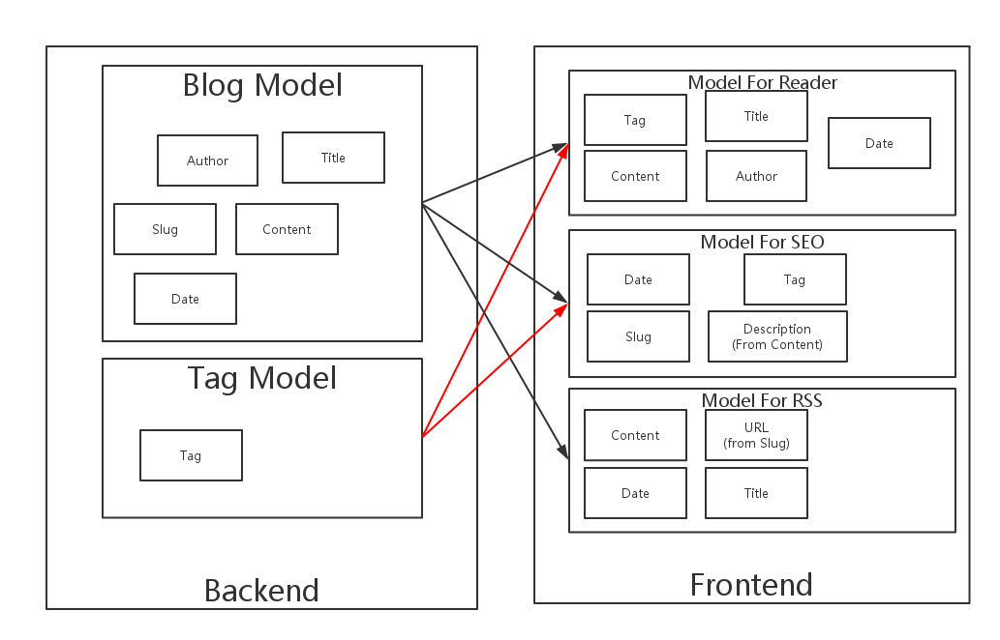

Domain Double Model
===

[](https://travis-ci.org/phodal/ddm)
[](https://codeclimate.com/github/phodal/ddm/coverage)
[](https://codeclimate.com/github/phodal/ddm)

> A simple library for Front-End to create Bounded Context Model.

Install
---

Bower:

```bash
bower install ddm
```
    
NPM:
    
```bash
npm install ddm
```

Usage
---

Usage:

```javascript
var ddm = new DDM();

originObject = {
  title: 'hello',
  blog: 'fdsf asdf fadsf ',
  author: 'phodal'
};
var newObject = {};
```

Basic Example:
    

```javascript
ddm.get(['title']).from(originObject).to(newObject);
```

Result
    
> {title: "hello"}

With Remove:

```javascript
ddm.get(['title', 'blog', 'author'])
  .from(originObject)
  .remove('title')
  .to(newObject);
```

Result: 

>  {blog: "fdsf asdf fadsf ", author: "phodal"}

With Add:

```javascript
ddm.get(['title'])
  .from(originObject)
  .add('tag', 'hello,world,linux')
  .to(newObject);
```

Result:

> {tag: "hello,world,linux", title: "hello"}

With Custom Handle:

```javascript
function handler(blog) {
  return blog[0];
}

ddm.get(['title', 'blog', 'author'])
  .from(originObject)
  .handle("blog", handler)
  .to(newObject);
```

Result:

> {title: "hello", blog: "A", author: "phodal"}

With Replace:

```javascript
 ddm.get(['title', 'blog', 'author'])
   .from(originObject)
   .replace("blog", "description")
   .to(newObject);
```

Result:

> {description: "fdsf asdf fadsf ", title: "hello", author: "phodal"}

DDM
---

 
对于我们的几个不同业务情景下，我们只使用同一个后台API的情形。如下图所示：



在我们的Blog Model里，我们有``Author``、``Title``、``Slug``、``Content``、``Data``几个字段。

而在我们使用的时候，我们需要依据这个模型应用到不同的场景下：

 - 面向读者的Model，只有``Tag``、``Title``、``Author``、``Date``、``Content``五个字段。
 - 面向SEO时，只有``Tag``、``Title``、``Date``、基于``Content``的``Description``四个字段。
 - 面向RSS时，则有``Title``、``Author``、``Date``、``Content``、``Slug``五个字段。

如果我们使用的是同一个模型，那么我们就很难做到分离上下文。并且在三种不同的场景下，Blog Model的含义都是不一样的。

于是，我们就需要想办法去区分不同的模型——这在后台来说是一件很容易的事。但是在前台谁想这样做？在这其中使用复杂的OO思想？

所以，我们有了DDM。 

License
---

[](http://ideas.phodal.com/)

© 2016 [Phodal Huang](https://www.phodal.com). This code is distributed under the MIT License. See `LICENSE` in this directory.

[](http://www.xuntayizhan.com/person/ji-ke-ai-qing-zhi-er-shi-dai-wo-dai-ma-bian-cheng-qu-ni-wei-qi-ke-hao-wan/)

